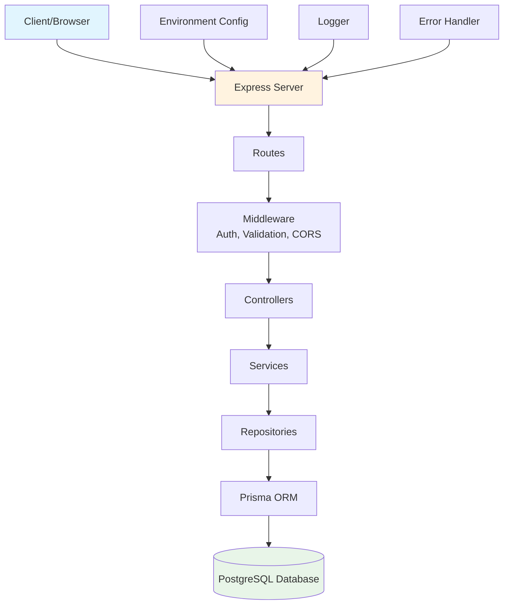
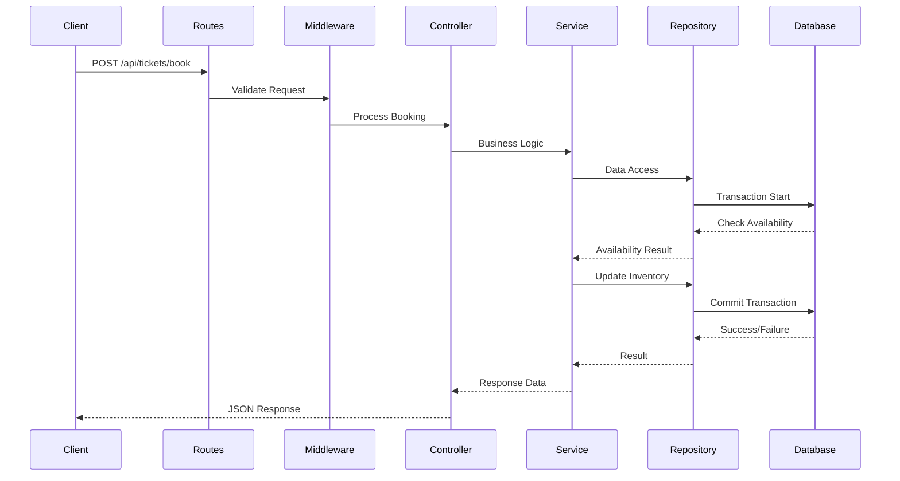
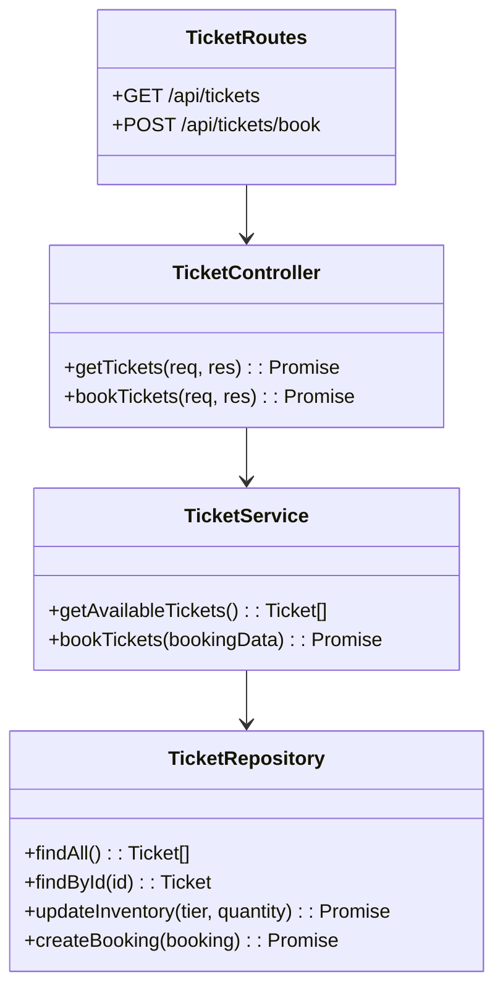
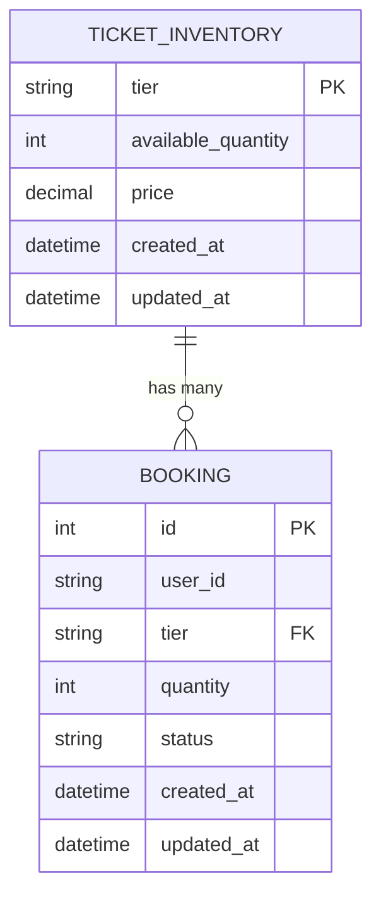
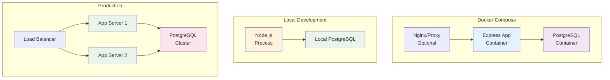

# Architectural Decisions and Trade-offs

This document outlines the key design decisions, trade-offs, and architectural considerations for the Ticket Booking System backend, aligned with the assignment requirements for achieving high availability, performance, and consistency.

## Table of Contents

- [Technology Stack Choices](#technology-stack-choices)
- [System Architecture Diagram](#system-architecture-diagram)
- [Trade-offs and Design Decisions](#trade-offs-and-design-decisions)
- [Consistency & Concurrency Handling](#consistency--concurrency-handling)
- [Availability and Reliability (Four Nines - 99.99%)](#availability-and-reliability-four-nines---9999)
- [Performance (p95 < 500ms for Booking Requests)](#performance-p95--500ms-for-booking-requests)
- [Scalability Considerations](#scalability-considerations)
- [User Experience Considerations](#user-experience-considerations)
- [Testing Strategy](#testing-strategy)
- [Deployment and Operations](#deployment-and-operations)
- [Environment Management](#environment-management)

## Technology Stack Choices

### Backend: Node.js + Express + TypeScript

- **Decision**: Chose Node.js over Golang (also allowed) for faster development iteration and ecosystem maturity with TypeScript.
- **Rationale**: TypeScript provides type safety, reducing runtime errors. Express is lightweight and sufficient for this scale.
- **Trade-off**: Node.js single-threaded nature vs. Golang's goroutines for concurrency. Node.js is acceptable here as we rely on database transactions for consistency.

### Database: PostgreSQL with Prisma ORM

- **Decision**: PostgreSQL for ACID compliance and transactional guarantees.
- **Rationale**: Prisma simplifies database operations while maintaining type safety. PostgreSQL handles concurrent transactions well.
- **Trade-off**: PostgreSQL vs. NoSQL (e.g., MongoDB) for flexibility. Chose SQL for strict consistency requirements in booking scenarios.

### Validation: Zod

- **Decision**: Zod for runtime type validation.
- **Rationale**: Lightweight, TypeScript-first, integrates well with Express middleware.
- **Trade-off**: Zod vs. more feature-rich libraries like Joi. Simplicity prioritized over advanced features not needed here.

### Security & Middleware: Helmet, CORS, Rate Limiting

- **Decision**: Standard security headers, configurable CORS, and rate limiting.
- **Rationale**: Essential for production readiness without over-engineering.
- **Trade-off**: Security overhead vs. performance. Minimal impact for this use case.

## System Architecture Diagram

### High-Level Architecture



### Data Flow for Ticket Booking



### Repository Pattern Implementation



### Database Schema Overview



### Deployment Architecture (Docker)



## Trade-offs and Design Decisions

### API Design: RESTful Endpoints

- **Decision**: Simple REST API with GET/POST endpoints.
- **Trade-off**: REST vs. GraphQL. REST chosen for simplicity and direct mapping to CRUD operations. GraphQL could reduce over-fetching but adds complexity not justified for this scope.

### API Documentation: Manual Documentation

- **Decision**: No automated API documentation (e.g., Swagger/OpenAPI) implemented at this time.
- **Rationale**: For the current assignment scope, manual documentation in the README file is sufficient. The API is simple with only a few endpoints, making comprehensive manual docs adequate for developers.
- **Future Enhancement**: Swagger/OpenAPI (via libraries like `swagger-jsdoc` and `swagger-ui-express`) could be implemented to provide interactive API documentation, request/response examples, and testing capabilities directly from the browser.
- **Trade-off**: Development speed and simplicity vs. developer experience and maintainability. Automated documentation improves API discoverability and reduces onboarding time but adds dependencies, maintenance overhead, and potential complexity. Given the small API surface area and assignment constraints, manual documentation was prioritized as an acceptable trade-off.

### Synchronous vs. Asynchronous Booking

- **Decision**: Synchronous booking flow with immediate response.
- **Trade-off**: Immediate feedback vs. scalability. Async processing (e.g., queues) would improve performance at scale but complicates user experience. Current design prioritizes simplicity and clear user feedback.

### Error Handling Strategy

- **Decision**: Custom `AppError` class with structured responses.
- **Rationale**: Consistent error format across API. Uses Pino for logging.
- **Trade-off**: Centralized error handling vs. granular control. Balances maintainability with debugging needs.

### Configuration Management

- **Decision**: Environment variables with dotenv.
- **Rationale**: Standard practice for different environments (dev, test, prod).
- **Trade-off**: Security vs. convenience. Sensitive data should be in secure vaults at scale.

## Consistency & Concurrency Handling

**Critical Requirement**: Prevent double-booking under race conditions.

## Consistency & Concurrency Handling

**Critical Requirement**: Prevent double-booking under race conditions.

### Mechanism

- **Database Transactions**: All booking operations use Prisma's `$transaction` to ensure atomicity.
- **Pessimistic Concurrency Control**: Uses row-level locking (`SELECT ... FOR UPDATE`) to prevent race conditions by locking inventory rows during booking operations.
- **Implementation**:
  ```typescript
  // In ticket.service.ts - bookTickets method
  const bookTickets = async (payload: BookTicketsRequestDto): Promise<BookTicketsResponseDTO> => {
    const { userId, tier, quantity } = payload;

    return prisma.$transaction(async (tx) => {
      const repo = repoFactory(tx); // transactional repo

      // Find ticket to check existence
      const ticket = await repo.findByTier(tier);
      if (!ticket) {
        throw new NotFoundError("TICKET_NOT_FOUND");
      }

      // Atomic decrement with row-level locking
      const data = await repo.decrementQuantity(tier, quantity);
      if (data.count === 0) {
        throw new UnprocessableEntityError("INSUFFICIENT_TICKETS", [
          {
            path: "quantity",
            message: "Requested quantity exceeds available tickets",
          },
        ]);
      }

      // Create booking record with user ID
      await tx.booking.create({
        data: {
          userId,
          tier,
          quantity,
          status: "confirmed",
        },
      });

      const updatedTicket = await repo.findByTier(tier);

      return {
        tier,
        bookedQuantity: quantity,
        remainingQuantity: updatedTicket.availableQuantity,
      };
    });
  };
  ```
- **Repository Layer Atomic Operation with Locking**:
  ```typescript
  // In ticket.repository.ts - decrementQuantity method
  async decrementQuantity(tier: TicketTier, quantity: number) {
    // Lock the row and check availability atomically
    const ticket = await this.db.$queryRaw<{ availableQuantity: number }[]>`
      SELECT "availableQuantity" FROM "TicketInventory"
      WHERE tier = ${tier}
      FOR UPDATE
    `;

    if (ticket.length === 0) {
      throw new NotFoundError("Ticket tier not found");
    }

    const currentQuantity = ticket[0].availableQuantity;

    if (currentQuantity < quantity) {
      return { count: 0 }; // Insufficient tickets
    }

    // Safe to decrement
    const result = await this.db.ticketInventory.updateMany({
      where: { tier },
      data: {
        availableQuantity: {
          decrement: quantity,
        },
      },
    });

    return result;
  }
  ```
- **How it Prevents Race Conditions**: The `SELECT ... FOR UPDATE` locks the specific `TicketInventory` row, preventing other transactions from reading or modifying it until the current transaction completes. This ensures that:
  - No two transactions can decrement the same ticket tier simultaneously
  - The check for available quantity and the decrement happen atomically
  - PostgreSQL's MVCC ensures serializable isolation for locked rows

### Trade-offs

- **Strong Consistency**: Ensures no double-booking with guaranteed data integrity, but may cause database contention under extremely high load.
- **Alternative Considered**: Optimistic locking with version numbers could improve concurrency but adds complexity and potential for failed retries.
- **Idempotency Not Implemented**: Request idempotency (preventing duplicate bookings from repeated client requests due to network failures, browser refreshes, or accidental retries) was considered but not implemented. In production systems, this would typically be achieved through idempotency keys, request deduplication, or business logic validation to ensure the same booking request produces identical results.
- **Decision**: Row-level pessimistic locking chosen for absolute correctness over performance optimization, as the assignment prioritizes consistency. The locking duration is minimal (milliseconds) and acceptable for ticket booking scenarios.

### Testing Race Conditions

- **Unit Tests**: Mock concurrent scenarios and verify atomic operations.
- **Integration Tests**: Use Supertest with Promise.all() to simulate concurrent requests. Test validates that only the correct number of bookings succeed when multiple users compete for limited tickets.
- **Concurrency Test Example**:
  ```typescript
  it("should prevent double booking under concurrency", async () => {
    const requests = Array.from({ length: 5 }).map(() =>
      prisma.$transaction(async (tx) => {
        const transactionalRepo = new TicketRepository(tx);
        return transactionalRepo.decrementQuantity(TicketTier.VIP, 3);
      }),
    );

    const results = await Promise.all(requests);
    const successful = results.filter((r) => r.count === 1).length;
    expect(successful).toBeLessThanOrEqual(3); // Only 3 can succeed for 10 available tickets
  });
  ```
- **Load Testing**: Artillery scripts verify behavior under stress conditions.

### Performance Impact

- **Lock Duration**: Locks held only during the booking transaction (typically <100ms)
- **Concurrency**: PostgreSQL efficiently manages row locks; no blocking for different ticket tiers
- **Scalability**: Suitable for high-throughput scenarios with proper database tuning

## Availability and Reliability (Four Nines - 99.99%)

**Target**: 99.99% uptime for 1M DAU and 50K concurrent users.

### Current Design Reliability

- Single PostgreSQL instance with connection pooling.
- Express error handling and health checks.
- Structured logging for monitoring.

### Scaling to Four Nines

- **Database Layer**:
  - PostgreSQL clustering with Patroni for automatic failover (<30s downtime).
  - Read replicas for query offloading.
  - Connection pooling prevents exhaustion.
- **Application Layer**:
  - Multiple Node.js instances behind load balancer (NGINX/AWS ALB).
  - PM2 for process management and auto-restart.
  - Horizontal scaling with auto-scaling groups.
- **Global Distribution**:
  - Multi-region deployment (e.g., AWS us-east-1, eu-west-1).
  - DNS-based routing (Route 53) for geographic load balancing.
  - CDN (Cloudflare) for static assets.
- **Monitoring & Alerting**:
  - Prometheus/Grafana for metrics collection.
  - Alerts for error rates, latency spikes.
  - SLO monitoring to maintain 99.99% (max 1 hour downtime/month).
- **Failure Scenarios**:
  - Database failover: Automatic promotion of replica.
  - Application crash: Load balancer routes to healthy instances.
  - Network issues: Multi-region redundancy.

### Trade-offs

- **Cost vs. Complexity**: Multi-region setup increases infrastructure costs but ensures global availability.
- **Data Consistency**: Eventual consistency across regions vs. strong consistency within regions.

## Performance (p95 < 500ms for Booking Requests)

**Target**: p95 latency < 500ms under load.

### Current Optimizations

- Database indexing on `tier` and `availableQuantity`.
- Connection pooling with Prisma.
- Compression and rate limiting.

### Scaling for Performance

- **Caching Layer**:
  - Redis for ticket inventory caching (cache-aside pattern).
  - Reduces database load for read-heavy operations.
- **Asynchronous Processing**:
  - Message queues (Redis/RabbitMQ) for booking confirmation.
  - API returns immediately after validation, processing happens async.
- **Database Optimization**:
  - Read replicas for inventory queries.
  - Query optimization with EXPLAIN plans.
  - Partitioning for large booking tables.
- **Load Balancing**:
  - Distribute requests across multiple app instances.
  - Session affinity not needed (stateless design).
- **CDN & Edge**:
  - Cloudflare for global content delivery.
  - Reduces latency for international users.
- **Load Testing**:
  - Tools: Artillery/k6 for 50K concurrent users simulation.
  - Target: p95 < 500ms, throughput > 1000 req/s.

### Trade-offs

- **Caching Consistency**: Stale data risk vs. performance gain. Cache invalidation on booking.
- **Async Processing**: Improved performance but requires idempotency handling.

## Scalability Considerations

**Assumptions**: 1M DAU, 50K peak concurrent users.

### Horizontal Scaling

- Stateless application design enables easy scaling.
- Database sharding if single instance becomes bottleneck.

### Vertical Scaling

- Increase instance sizes for CPU/memory intensive operations.

### Cost Optimization

- Auto-scaling based on metrics.
- Spot instances for non-critical workloads.

## User Experience Considerations

### UI/UX Design (Conceptual)

- Clean React interface for ticket selection.
- Real-time availability updates (polling/WebSocket).
- Loading states and clear error messages.
- Mobile-responsive design.

### Global Users

- USD pricing only (as specified).
- Timezone-agnostic booking (server timestamps).
- Localized error messages (future enhancement).

### Mock User Management

Since the assignment specifies that users can be mocked without full user management:

- **User Identification**: Each booking request includes a `userId` (string) to simulate different users.
- **Client-side Generation**: Frontend can generate UUIDs or simple identifiers (e.g., `user-${Date.now()}`) for mock users.
- **No Authentication**: No login/signup required - users are identified purely by the provided `userId`.
- **Data Isolation**: Bookings are tracked per user, allowing multiple users to book simultaneously without conflicts.
- **Testing**: Different user IDs can be used to test concurrent booking scenarios.

Example client-side user ID generation:

```javascript
// Generate mock user ID
const userId = `user-${crypto.randomUUID()}`;
// Or simpler: const userId = `user-${Date.now()}`;
```

### Booking Flow

- Optimistic UI updates with rollback on failure.
- Confirmation emails (simulated).

## Testing Strategy

### Unit Tests

- Test business logic in isolation (services, repositories).
- Mock external dependencies.

### Integration Tests

- Full API testing with test database.
- Verify end-to-end booking flows.

### Load Testing

- Simulate concurrent users to test race conditions.
- Performance benchmarks.

### Trade-offs

- Comprehensive testing improves reliability but slows development.
- Prioritized critical paths (booking logic).

## Deployment and Operations

### Containerization

- Docker for consistent environments.
- Multi-stage builds for optimization.

### CI/CD

- GitHub Actions for automated testing and deployment.
- Blue-green deployments for zero-downtime.

### Monitoring

- Application logs via Pino.
- Infrastructure metrics via cloud provider.
- Alerting on key thresholds.

### Security

- Environment-specific secrets management.
- Regular dependency updates.
- Penetration testing for production.

## Environment Management

Managing development, staging, and production environments is crucial for maintaining code quality, testing changes safely, and ensuring reliable deployments.

### Environment Strategy

- **Development**: Local environment for active development and debugging.
- **Staging**: Pre-production environment that mirrors production for final testing.
- **Production**: Live environment serving end users.

### Docker-based Environment Management

The project uses Docker for containerization to ensure consistency across environments.

#### Docker Files

- `Dockerfile.dev`: Optimized for development with hot reloading and debugging tools.
- `Dockerfile.prod`: Optimized for production with multi-stage builds for smaller images and security hardening.
- `docker-compose.yml`: Orchestrates services (app, database) for local development.

#### Environment-specific Configurations

- **Environment Variables**: Separate `.env` files for each environment:
  - `.env` (development)
  - `.env.staging` (staging)
  - `.env.prod` (production)
- **Database**: Different database instances/connections per environment to prevent data contamination.

#### Development Environment

```bash
# Using docker-compose for local development
docker-compose up --build

# Or run locally with npm
npm run dev
```

- Features: Hot reloading, attached debugger, local PostgreSQL via Docker.

#### Staging Environment

- Deployed via CI/CD pipeline after successful tests.
- Uses staging-specific database and environment variables.
- Purpose: Integration testing, user acceptance testing, performance validation.

#### Production Environment

- Deployed via automated pipeline with blue-green strategy.
- Uses production Docker image (`Dockerfile.prod`).
- Features: Optimized image size, security scanning, health checks.

### CI/CD Pipeline

#### GitHub Actions Workflow

- **Triggers**: Push to main/develop branches, pull requests.
- **Stages**:
  1. **Lint & Test**: Run ESLint, unit/integration tests.
  2. **Build**: Create Docker images for dev/staging/prod.
  3. **Deploy to Staging**: Automated deployment after tests pass.
  4. **Manual Approval**: For production deployment.
  5. **Deploy to Production**: Blue-green deployment with rollback capability.

#### Deployment Strategy

- **Blue-Green Deployments**: Two identical production environments (blue/green). Traffic switches after successful health checks.
- **Rollback**: Automated rollback to previous version if health checks fail.
- **Zero Downtime**: Load balancer routes traffic during deployment.

### Infrastructure as Code (IaC)

For production scalability:

- **Terraform/CloudFormation**: Define infrastructure (ECS, RDS, ALB) as code.
- **Environment-specific Modules**: Reusable configurations for dev/staging/prod.

### Monitoring and Observability

#### Per Environment

- **Development**: Local logs and debugging tools.
- **Staging**: Full monitoring stack (Prometheus, Grafana) for performance validation.
- **Production**: Comprehensive monitoring with alerts, distributed tracing.

#### Tools

- **Application Monitoring**: Pino logs aggregated via ELK stack or cloud logging.
- **Infrastructure Monitoring**: CloudWatch, DataDog, or Prometheus.
- **Error Tracking**: Sentry for error aggregation across environments.

### Secrets Management

- **Development**: Local `.env` files (not committed).
- **Staging/Production**: Use AWS Secrets Manager, HashiCorp Vault, or similar for secure storage.
- **CI/CD**: Inject secrets at build time, never store in code.

### Database Management

#### Migrations

- Prisma migrations run automatically in CI/CD pipeline.
- Separate migration history per environment.

#### Backups

- **Development**: No backups needed.
- **Staging**: Daily backups for recovery testing.
- **Production**: Automated backups with point-in-time recovery.

### Scaling Environments

- **Development**: Single container setup.
- **Staging**: Scaled to match production capacity for accurate testing.
- **Production**: Auto-scaling based on metrics (CPU, memory, request rate).

### Trade-offs

- **Docker Overhead**: Containerization adds complexity but ensures environment consistency.
- **Cost**: Separate environments increase infrastructure costs but reduce production incidents.
- **Deployment Speed**: Automated pipelines vs. manual deployments. Automation preferred for reliability.

## Summary

This design prioritizes **correctness and consistency** for the booking system while providing a foundation for **scalability**. Key decisions favor simplicity and reliability over premature optimization, with clear paths for scaling to meet the assignment's availability and performance targets. The database transaction approach ensures no double-booking, and the architecture supports horizontal scaling for global users.

For the full implementation, see the main `README.md` for setup and run instructions.</content>
<parameter name="filePath">/Users/branded/Desktop/projects/nodejs-projects/ticket-booking-assignment/ticket-booking-system/ticket-booking-node-backend/ARCHITECTURAL_DECISIONS.md
