# Architectural Decisions and Trade-offs

This document outlines the key design decisions, trade-offs, and architectural considerations for the Ticket Booking System backend, aligned with the assignment requirements for achieving high availability, performance, and consistency.

## Table of Contents

- [Technology Stack Choices](#technology-stack-choices)
- [System Architecture Diagram](#system-architecture-diagram)
- [Trade-offs and Design Decisions](#trade-offs-and-design-decisions)
- [Consistency & Concurrency Handling](#consistency--concurrency-handling)
- [Availability and Reliability (Four Nines - 99.99%)](#availability-and-reliability-four-nines---9999)
- [Performance (p95 < 500ms for Booking Requests)](#performance-p95--500ms-for-booking-requests)
- [Scalability Considerations](#scalability-considerations)
- [User Experience Considerations](#user-experience-considerations)
- [Testing Strategy](#testing-strategy)
- [Deployment and Operations](#deployment-and-operations)
- [Environment Management](#environment-management)

## Technology Stack Choices

### Backend: Node.js + Express + TypeScript

- **Decision**: Chose Node.js over Golang (also allowed) for faster development iteration and ecosystem maturity with TypeScript.
- **Rationale**: TypeScript provides type safety, reducing runtime errors. Express is lightweight and sufficient for this scale.
- **Trade-off**: Node.js single-threaded nature vs. Golang's goroutines for concurrency. Node.js is acceptable here as we rely on database transactions for consistency.

### Database: PostgreSQL with Prisma ORM

- **Decision**: PostgreSQL for ACID compliance and transactional guarantees.
- **Rationale**: Prisma simplifies database operations while maintaining type safety. PostgreSQL handles concurrent transactions well.
- **Trade-off**: PostgreSQL vs. NoSQL (e.g., MongoDB) for flexibility. Chose SQL for strict consistency requirements in booking scenarios.

### Validation: Zod

- **Decision**: Zod for runtime type validation.
- **Rationale**: Lightweight, TypeScript-first, integrates well with Express middleware.
- **Trade-off**: Zod vs. more feature-rich libraries like Joi. Simplicity prioritized over advanced features not needed here.

### Security & Middleware: Helmet, CORS, Rate Limiting

- **Decision**: Standard security headers, configurable CORS, and rate limiting.
- **Rationale**: Essential for production readiness without over-engineering.
- **Trade-off**: Security overhead vs. performance. Minimal impact for this use case.

## System Architecture Diagram

### High-Level Architecture


### Data Flow for Ticket Booking

```mermaid
sequenceDiagram
    participant Client
    participant Routes
    participant Middleware
    participant Controller
    participant Service
    participant Repository
    participant Database

    Client->>Routes: POST /api/tickets/book
    Routes->>Middleware: Validate Request
    Middleware->>Controller: Process Booking
    Controller->>Service: Business Logic

    rect rgb(240, 248, 255)
        Service->>Repository: Start Transaction + Check Availability
        Repository->>Database: SELECT ... FOR UPDATE (Row Lock)
        Database-->>Repository: Lock Acquired + Current Quantity
        Repository-->>Service: Available Quantity

        Service->>Service: Calculate Total Amount
        Service->>Service: Simulate Payment Processing
        Service-->>Service: Payment Success/Failure

        alt Payment Success
            Service->>Repository: Decrement Inventory
            Repository->>Database: UPDATE availableQuantity
            Service->>Repository: Create Booking Record
            Repository->>Database: INSERT booking
            Repository->>Database: COMMIT Transaction
            Database-->>Repository: Transaction Committed
        else Payment Failure
            Repository->>Database: ROLLBACK Transaction
            Database-->>Repository: Transaction Rolled Back
        end
    end

    Repository-->>Service: Result (Success/Failure)
    Service-->>Controller: Response Data
    Controller-->>Client: JSON Response

    Note over Database: 🔒 Row-level locking prevents<br/>race conditions & double-booking
    Note over Service: 💳 Simulated payment (90% success)<br/>Real system: Stripe/PayPal integration
    Note over Repository: 🔄 Transaction ensures atomicity<br/>All-or-nothing booking operation
```



### Repository Pattern Implementation


### Database Schema Overview


### Deployment Architecture (Current vs Future)

**Current Implementation**: Simple deployments for development and demonstration.

#### Current Deployments
1. **Local Development**: Docker Compose setup with Express app and PostgreSQL containers
2. **Demo Deployment**: Render free tier with source-based deployment from GitHub repository


```

#### Render Free Tier Trade-offs
**Decision**: Used Render free tier with source-based deployment for quick demonstration.
**Deployment Approach**: Direct GitHub integration (no Docker containers) - Render pulls source code, runs build, and starts server.
**Limitations**:
- **Cold Starts**: App sleeps after 15 minutes inactivity, causing 10-30 second delays
- **Resource Constraints**: Limited CPU/memory, not suitable for production traffic
- **Usage Limits**: 750 hours/month free quota, then service pauses
- **No Custom Domains**: Uses render.com subdomain only
- **Source-based Trade-off**: Simpler setup and faster deployment vs. container consistency and environment isolation

**Trade-off**: Quick source-based demo deployment vs. containerized production hosting. Suitable for assignment demonstration but lacks deployment consistency and environment control.

#### Future Scalability (Production-Ready Deployment)

**What Can Be Done and How**:
- **Cloud Platforms**: AWS ECS/EKS, Google Cloud Run, Azure Container Apps
- **Load Balancing**: Application Load Balancers (ALB) with auto-scaling groups
- **Multi-region Deployment**: Global distribution with Route 53 DNS routing
- **CDN Integration**: Cloudflare or CloudFront for static assets and global caching
- **Database Scaling**: RDS Aurora with read replicas, connection pooling
- **Monitoring & Observability**: CloudWatch, DataDog, or Prometheus for metrics
- **CI/CD Pipelines**: GitHub Actions with blue-green deployments
- **Infrastructure as Code**: Terraform/CloudFormation for automated provisioning

**Decision**: Focused on core business logic rather than complex deployment infrastructure for assignment scope.
**Trade-off**: Development speed vs. production operations. Simple setup allows faster iteration but lacks enterprise-grade deployment automation.

## Trade-offs and Design Decisions

### API Design: RESTful Endpoints

- **Decision**: Simple REST API with GET/POST endpoints.
- **Trade-off**: REST vs. GraphQL. REST chosen for simplicity and direct mapping to CRUD operations. GraphQL could reduce over-fetching but adds complexity not justified for this scope.

### API Documentation: Manual Documentation

- **Decision**: No automated API documentation (e.g., Swagger/OpenAPI) implemented at this time.
- **Rationale**: For the current assignment scope, manual documentation in the README file is sufficient. The API is simple with only a few endpoints, making comprehensive manual docs adequate for developers.
- **Future Enhancement**: Swagger/OpenAPI (via libraries like `swagger-jsdoc` and `swagger-ui-express`) could be implemented to provide interactive API documentation, request/response examples, and testing capabilities directly from the browser.
- **Trade-off**: Development speed and simplicity vs. developer experience and maintainability. Automated documentation improves API discoverability and reduces onboarding time but adds dependencies, maintenance overhead, and potential complexity. Given the small API surface area and assignment constraints, manual documentation was prioritized as an acceptable trade-off.

### Synchronous vs. Asynchronous Booking

- **Decision**: Synchronous booking flow with immediate response.
- **Trade-off**: Immediate feedback vs. scalability. Async processing (e.g., queues) would improve performance at scale but complicates user experience. Current design prioritizes simplicity and clear user feedback.

### Payment Processing: Simulation vs. Real Gateway

#### Current Implementation

**Decision**: Implemented payment simulation with random success/failure for assignment scope.
**Mechanism**:
- **Simulation Logic**: 90% success rate, 10% failure rate with 100ms processing delay.
- **Integration Point**: Payment validation happens after inventory decrement but before booking confirmation.
- **Error Handling**: Payment failures trigger transaction rollback, restoring inventory.

**Implementation Details**:
```typescript
const simulatePayment = async (amount: number): Promise<boolean> => {
  // Simulate payment processing delay
  await new Promise((resolve) => setTimeout(resolve, 100));

  // Simulate 90% success rate, 10% failure rate
  const success = Math.random() > 0.5;

  if (!success) {
    console.log(`Payment failed for amount: $${amount}`);
  } else {
    console.log(`Payment succeeded for amount: $${amount}`);
  }

  return success;
};
```

#### Trade-offs

**Decision Rationale**: Simulation chosen for assignment scope to focus on core booking logic rather than payment integration complexity.
- **Development Speed vs. Production Readiness**: Simulation allows quick testing of booking flows without payment provider setup, but lacks real-world payment handling.
- **Consistency vs. Complexity**: Simulated payments maintain transaction integrity but don't handle real payment edge cases (chargebacks, disputes, PCI compliance).
- **Testing Limitations**: Cannot test real payment failures, network timeouts, or provider-specific error scenarios.

#### Future Scalability

**What Can Be Done and How**:
- **Payment Gateway Integration**: Stripe, PayPal, or Adyen for production payment processing with webhooks for status updates.
- **Idempotency Keys**: Prevent duplicate charges from retry requests using payment provider's idempotency features.
- **Payment Intents**: Implement Stripe Payment Intents for better UX with saved payment methods and authentication flows.
- **PCI Compliance**: Use payment provider's hosted fields to avoid handling sensitive card data directly.
- **Webhook Handling**: Asynchronous payment confirmations via webhooks to handle delayed payment processing.
- **Refund Management**: Automated refund processing for failed bookings or cancellations.
- **Multi-Currency**: Support for international payments with currency conversion and localization.

**Production Considerations**: Real payment integration requires PCI DSS compliance, webhook security validation, and handling of payment disputes/refunds.

### Error Handling Strategy

- **Decision**: Custom `AppError` class with structured responses.
- **Rationale**: Consistent error format across API. Uses Pino for logging.
- **Trade-off**: Centralized error handling vs. granular control. Balances maintainability with debugging needs.

### Configuration Management

- **Decision**: Environment variables with dotenv.
- **Rationale**: Standard practice for different environments (dev, test, prod).
- **Trade-off**: Security vs. convenience. Sensitive data should be in secure vaults at scale.


## Consistency & Concurrency Handling

**Critical Requirement**: Prevent double-booking under race conditions.

### Current Implementation

**Decision**: Implemented pessimistic concurrency control using database row-level locking to ensure absolute consistency.
**Mechanism**:
- **Database Transactions**: All booking operations use Prisma's `$transaction` to ensure atomicity.
- **Pessimistic Concurrency Control**: Uses `SELECT ... FOR UPDATE` to lock inventory rows during booking operations.
- **Atomic Operations**: Check availability and decrement quantity happen in the same transaction.

**Implementation Details**:
```typescript
// Row-level locking prevents race conditions
async decrementQuantity(tier: TicketTier, quantity: number) {
  const ticket = await this.db.$queryRaw<{ availableQuantity: number }[]>`
    SELECT "availableQuantity" FROM "TicketInventory"
    WHERE tier = ${tier}
    FOR UPDATE
  `;

  if (currentQuantity < quantity) {
    return { count: 0 }; // Insufficient tickets
  }

  // Safe to decrement
  const result = await this.db.ticketInventory.updateMany({
    where: { tier },
    data: { availableQuantity: { decrement: quantity } }
  });

  return result;
}
```

### Trade-offs

**Decision Rationale**: Chose strong consistency over performance optimization for ticket booking critical path.
- **Strong Consistency vs Performance**: Row-level locking ensures no double-booking but may cause database contention under extreme load.
- **Pessimistic vs Optimistic Locking**: Pessimistic locking chosen for absolute correctness over optimistic locking's better concurrency (but potential for failed retries).
- **Idempotency Not Implemented**: Considered but not implemented for assignment scope - would require idempotency keys to handle duplicate requests from network failures.

### Future Scalability

**What Can Be Done and How**:
- **Optimistic Locking**: Add version columns for better concurrency with retry logic.
- **Idempotency Keys**: Implement request deduplication using Redis to handle duplicate bookings from network retries.
- **Distributed Locking**: Use Redis distributed locks for cross-service consistency.
- **Event Sourcing**: Implement event-driven architecture with eventual consistency for high-scale scenarios.
- **CQRS Pattern**: Separate read/write models to optimize for different consistency requirements.

**Performance Impact**: Current locks held <100ms, suitable for assignment scale. For production, consider optimistic locking with exponential backoff for better throughput.

## Availability and Reliability (Four Nines - 99.99%)

**Target**: 99.99% uptime for 1M DAU and 50K concurrent users.

### Current Implementation

**Decision**: Implemented basic reliability features suitable for assignment scope.
- **Database Layer**: Single PostgreSQL instance with connection pooling.
- **Application Layer**: Express error handling, health checks, and structured logging.
- **Process Management**: Basic Node.js process with global error handlers.

### Trade-offs

**Decision Rationale**: Focused on core business logic rather than production infrastructure complexity.
- **Simplicity vs Production Readiness**: Single instance approach is simple but lacks high availability. Current design prioritizes development speed over enterprise-grade reliability.
- **Cost vs Availability**: No redundancy implemented to keep assignment scope manageable. Production would require significant infrastructure investment.

### Future Scalability

**What Can Be Done and How**:
- **Application Layer**: 
  - **Load Balancers**: AWS ALB or NGINX to distribute traffic across multiple API instances
  - **Multiple API Instances**: Horizontal scaling with auto-scaling groups based on CPU/memory metrics
  - PM2 for process management and zero-downtime deployments
- **Database Layer**: PostgreSQL clustering with Patroni for automatic failover (<30s downtime), read replicas for query offloading.
- **Global Distribution**: Multi-region deployment with DNS-based routing (Route 53), CDN (Cloudflare) for static assets.
- **Monitoring & Alerting**: Prometheus/Grafana for metrics, SLO monitoring to maintain 99.99% uptime (max 1 hour downtime/month).
- **Failure Scenarios**: Automatic database failover, load balancer routing around failed instances, multi-region redundancy for network issues.

## Performance (p95 < 500ms for Booking Requests)

**Target**: p95 latency < 500ms under load.

### Current Implementation

**Decision**: Implemented basic performance optimizations suitable for assignment scale.
- **Database Layer**: Indexing on `tier` and `availableQuantity` columns, connection pooling with Prisma.
- **Application Layer**: Compression, rate limiting, and efficient Express middleware chain.
- **Query Optimization**: Direct SQL queries for critical booking path to minimize ORM overhead.

### Trade-offs

**Decision Rationale**: Balanced performance with development simplicity for assignment scope.
- **Optimization vs Complexity**: Basic optimizations chosen over advanced caching/layering to keep implementation manageable.
- **Synchronous vs Asynchronous**: Synchronous booking flow prioritizes user experience clarity over potential performance gains from async processing.
- **Database Load**: No read replicas or caching implemented - suitable for assignment scale but would need optimization for production load.

### Future Scalability

**What Can Be Done and How**:
- **Database Optimization**: 
  - **Read Replicas**: PostgreSQL read replicas for inventory queries to reduce primary database load and improve read performance
  - Query optimization with EXPLAIN plans, partitioning for large booking tables
- **Caching Layer**: Redis for ticket inventory caching (cache-aside pattern) to reduce database load for read operations.
- **Asynchronous Processing**: Message queues (Redis/RabbitMQ) for booking confirmation, allowing immediate API response after validation.
- **Load Balancing**: Distribute requests across multiple app instances, CDN (Cloudflare) for global content delivery.
- **Load Testing**: Artillery/k6 for 50K concurrent users simulation, targeting p95 < 500ms and throughput > 1000 req/s.

## Scalability Considerations

**Assumptions**: 1M DAU, 50K peak concurrent users.

### Application Statelessness

**Current Implementation**: Node.js/Express app is stateless - no session storage, in-memory state, or sticky sessions required.
- **Benefits**: Enables horizontal scaling across multiple instances behind load balancers
- **Session Management**: User identification via request parameters (userId) - no server-side session storage
- **Load Distribution**: Requests can be routed to any available instance without affinity requirements

### Horizontal Scaling

- **API Instances**: Multiple Node.js app instances behind load balancers for handling concurrent requests
- **Load Balancers**: Distribute traffic across instances (e.g., AWS ALB, NGINX) with health checks
- **Auto-scaling**: Scale instances based on CPU/memory metrics or request volume
- **Database sharding if single instance becomes bottleneck**

### Vertical Scaling

- Increase instance sizes for CPU/memory intensive operations.

### Cost Optimization

- Auto-scaling based on metrics.
- Spot instances for non-critical workloads.

## User Experience Considerations

### UI/UX Design (Conceptual)

- Clean React interface for ticket selection.
- Real-time availability updates (polling/WebSocket).
- Loading states and clear error messages.
- Mobile-responsive design.

### Global Users

- USD pricing only (as specified).
- Timezone-agnostic booking (server timestamps).
- Localized error messages (future enhancement).

### Mock User Management

Since the assignment specifies that users can be mocked without full user management:

- **User Identification**: Each booking request includes a `userId` (string) to simulate different users.
- **Client-side Generation**: Frontend can generate UUIDs or simple identifiers (e.g., `user-${Date.now()}`) for mock users.
- **No Authentication**: No login/signup required - users are identified purely by the provided `userId`.
- **Data Isolation**: Bookings are tracked per user, allowing multiple users to book simultaneously without conflicts.
- **Testing**: Different user IDs can be used to test concurrent booking scenarios.

Example client-side user ID generation:

```javascript
// Generate mock user ID
const userId = `user-${crypto.randomUUID()}`;
// Or simpler: const userId = `user-${Date.now()}`;
```

### Booking Flow

- Optimistic UI updates with rollback on failure.
- Confirmation emails (simulated).

## Testing Strategy

### Unit Tests

- Test business logic in isolation (services, repositories).
- Mock external dependencies.

### Integration Tests

- Full API testing with test database.
- Verify end-to-end booking flows.

### Load Testing

- Simulate concurrent users to test race conditions.
- Performance benchmarks.

### Trade-offs

- Comprehensive testing improves reliability but slows development.
- Prioritized critical paths (booking logic).

## Deployment and Operations

### Containerization

- Docker for consistent environments.
- Multi-stage builds for optimization.

### CI/CD

- GitHub Actions for automated testing and deployment.
- Blue-green deployments for zero-downtime.

### Monitoring

- Application logs via Pino.
- Infrastructure metrics via cloud provider.
- Alerting on key thresholds.

### Security

- Environment-specific secrets management.
- Regular dependency updates.
- Penetration testing for production.

## Environment Management

Managing development, staging, and production environments is crucial for maintaining code quality, testing changes safely, and ensuring reliable deployments.

### Environment Strategy

- **Development**: Local environment for active development and debugging.
- **Staging**: Pre-production environment that mirrors production for final testing.
- **Production**: Live environment serving end users.

### Docker-based Environment Management

**Current Implementation**: Basic Docker Compose for local development only.

#### Current Docker Setup
- `docker-compose.yml`: Simple orchestration of app and PostgreSQL containers
- `Dockerfile`: Basic Node.js container for development
- **Purpose**: Consistent local development environment

#### Future Scalability (Not Implemented)
- Multi-stage Docker builds for production optimization
- Separate Dockerfiles for dev/staging/production
- Kubernetes orchestration
- CI/CD with automated deployments

**Decision**: Focused on core business logic rather than complex deployment infrastructure.
**Trade-off**: Development speed vs. production operations. Simple setup allows faster iteration but lacks production deployment automation.

### CI/CD Pipeline

**Current Implementation**: No automated CI/CD pipeline implemented.

**Future Scalability** (Not Implemented):
- GitHub Actions for automated testing and deployment
- Blue-green deployments for zero-downtime
- Automated rollback capabilities

**Decision**: Focused on core business logic rather than deployment automation for assignment scope.
**Trade-off**: Manual deployment process vs. automated pipelines. Current approach prioritizes development speed over operational automation.

### Infrastructure as Code (IaC)

For production scalability:

- **Terraform/CloudFormation**: Define infrastructure (ECS, RDS, ALB) as code.
- **Environment-specific Modules**: Reusable configurations for dev/staging/prod.

### Monitoring and Observability

#### Per Environment

- **Development**: Local logs and debugging tools.
- **Staging**: Full monitoring stack (Prometheus, Grafana) for performance validation.
- **Production**: Comprehensive monitoring with alerts, distributed tracing.

#### Tools

- **Application Monitoring**: Pino logs aggregated via ELK stack or cloud logging.
- **Infrastructure Monitoring**: CloudWatch, DataDog, or Prometheus.
- **Error Tracking**: Sentry for error aggregation across environments.

### Secrets Management

- **Development**: Local `.env` files (not committed).
- **Staging/Production**: Use AWS Secrets Manager, HashiCorp Vault, or similar for secure storage.
- **CI/CD**: Inject secrets at build time, never store in code.

### Database Management

#### Migrations

- Prisma migrations run automatically in CI/CD pipeline.
- Separate migration history per environment.

#### Backups

- **Development**: No backups needed.
- **Staging**: Daily backups for recovery testing.
- **Production**: Automated backups with point-in-time recovery.

### Scaling Environments

- **Development**: Single container setup.
- **Staging**: Scaled to match production capacity for accurate testing.
- **Production**: Auto-scaling based on metrics (CPU, memory, request rate).

### Trade-offs

- **Docker Overhead**: Containerization adds complexity but ensures environment consistency.
- **Cost**: Separate environments increase infrastructure costs but reduce production incidents.
- **Deployment Speed**: Automated pipelines vs. manual deployments. Automation preferred for reliability.

## Summary

This design prioritizes **correctness and consistency** for the booking system while providing a foundation for **scalability**. Key decisions favor simplicity and reliability over premature optimization, with clear paths for scaling to meet the assignment's availability and performance targets. The database transaction approach ensures no double-booking, and the architecture supports horizontal scaling for global users.

For the full implementation, see the main `README.md` for setup and run instructions.</content>
<parameter name="filePath">/Users/branded/Desktop/projects/nodejs-projects/ticket-booking-assignment/ticket-booking-system/ticket-booking-node-backend/ARCHITECTURAL_DECISIONS.md
